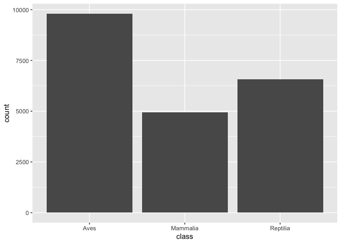
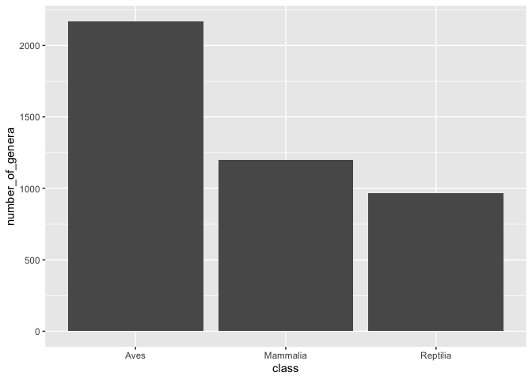
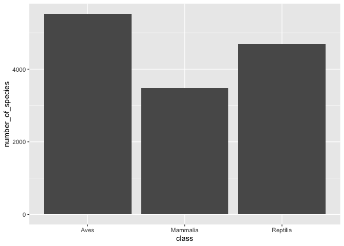
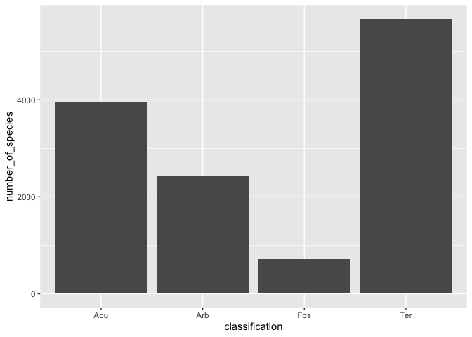
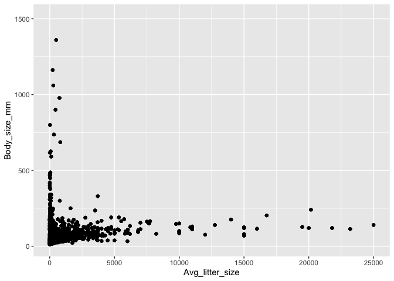
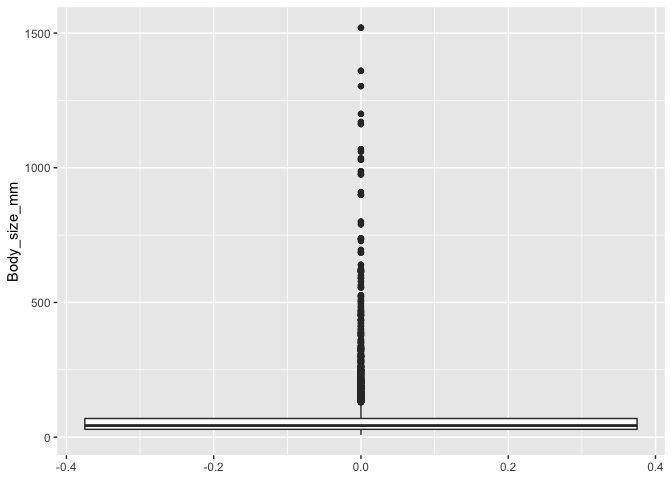
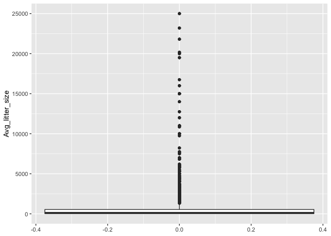

## Instructions
Answer the following questions and complete the exercises in RMarkdown. Please embed all of your code and push your final work to your repository. Your final lab report should be organized, clean, and run free from errors. Remember, you must remove the `#` for the included code chunks to run.  


```r
#install.packages("anomalize")
```


## Libraries

```r
library(tidyverse)
```

```
## <U+2500><U+2500> Attaching packages <U+2500><U+2500><U+2500><U+2500><U+2500><U+2500><U+2500><U+2500><U+2500><U+2500><U+2500><U+2500><U+2500><U+2500><U+2500><U+2500><U+2500><U+2500><U+2500><U+2500><U+2500><U+2500><U+2500><U+2500><U+2500><U+2500><U+2500><U+2500><U+2500><U+2500><U+2500><U+2500><U+2500><U+2500><U+2500><U+2500><U+2500><U+2500><U+2500><U+2500><U+2500><U+2500><U+2500><U+2500><U+2500><U+2500><U+2500><U+2500><U+2500><U+2500><U+2500><U+2500><U+2500><U+2500><U+2500><U+2500><U+2500><U+2500><U+2500><U+2500><U+2500><U+2500><U+2500><U+2500><U+2500><U+2500><U+2500><U+2500><U+2500><U+2500><U+2500><U+2500><U+2500><U+2500><U+2500><U+2500><U+2500><U+2500><U+2500><U+2500><U+2500><U+2500><U+2500><U+2500><U+2500><U+2500><U+2500><U+2500><U+2500><U+2500><U+2500><U+2500><U+2500><U+2500><U+2500><U+2500><U+2500><U+2500><U+2500><U+2500><U+2500><U+2500><U+2500><U+2500> tidyverse 1.3.0 <U+2500><U+2500>
```

```
## <U+2713> ggplot2 3.2.1     <U+2713> purrr   0.3.3
## <U+2713> tibble  2.1.3     <U+2713> dplyr   0.8.3
## <U+2713> tidyr   1.0.0     <U+2713> stringr 1.4.0
## <U+2713> readr   1.3.1     <U+2713> forcats 0.4.0
```

```
## <U+2500><U+2500> Conflicts <U+2500><U+2500><U+2500><U+2500><U+2500><U+2500><U+2500><U+2500><U+2500><U+2500><U+2500><U+2500><U+2500><U+2500><U+2500><U+2500><U+2500><U+2500><U+2500><U+2500><U+2500><U+2500><U+2500><U+2500><U+2500><U+2500><U+2500><U+2500><U+2500><U+2500><U+2500><U+2500><U+2500><U+2500><U+2500><U+2500><U+2500><U+2500><U+2500><U+2500><U+2500><U+2500><U+2500><U+2500><U+2500><U+2500><U+2500><U+2500><U+2500><U+2500><U+2500><U+2500><U+2500><U+2500><U+2500><U+2500><U+2500><U+2500><U+2500><U+2500><U+2500><U+2500><U+2500><U+2500><U+2500><U+2500><U+2500><U+2500><U+2500><U+2500><U+2500><U+2500><U+2500><U+2500><U+2500><U+2500><U+2500><U+2500><U+2500><U+2500><U+2500><U+2500><U+2500><U+2500><U+2500><U+2500><U+2500><U+2500><U+2500><U+2500><U+2500><U+2500><U+2500><U+2500><U+2500><U+2500><U+2500><U+2500><U+2500><U+2500><U+2500><U+2500><U+2500><U+2500><U+2500><U+2500><U+2500> tidyverse_conflicts() <U+2500><U+2500>
## x dplyr::filter() masks stats::filter()
## x dplyr::lag()    masks stats::lag()
```

```r
library(naniar)
library(skimr)
```

```
## 
## Attaching package: 'skimr'
```

```
## The following object is masked from 'package:naniar':
## 
##     n_complete
```

```r
library(anomalize)
```

```
## <U+2550><U+2550> Use anomalize to improve your Forecasts by 50%! <U+2550><U+2550><U+2550><U+2550><U+2550><U+2550><U+2550><U+2550><U+2550><U+2550><U+2550><U+2550><U+2550><U+2550><U+2550><U+2550><U+2550><U+2550><U+2550><U+2550><U+2550><U+2550><U+2550><U+2550><U+2550><U+2550><U+2550><U+2550><U+2550><U+2550><U+2550><U+2550><U+2550><U+2550><U+2550><U+2550><U+2550><U+2550><U+2550><U+2550><U+2550><U+2550><U+2550><U+2550><U+2550><U+2550><U+2550><U+2550><U+2550><U+2550><U+2550><U+2550><U+2550><U+2550><U+2550><U+2550><U+2550><U+2550><U+2550><U+2550><U+2550><U+2550><U+2550><U+2550><U+2550><U+2550><U+2550><U+2550><U+2550><U+2550><U+2550><U+2550><U+2550><U+2550><U+2550><U+2550><U+2550><U+2550><U+2550><U+2550><U+2550><U+2550><U+2550><U+2550><U+2550><U+2550><U+2550><U+2550><U+2550><U+2550><U+2550><U+2550><U+2550><U+2550>
## Business Science offers a 1-hour course - Lab #18: Time Series Anomaly Detection!
## </> Learn more at: https://university.business-science.io/p/learning-labs-pro </>
```

## Data
For this homework, we will use two different data sets. Please load `amniota` and `amphibio`.  

### `amniota` data
Myhrvold N, Baldridge E, Chan B, Sivam D, Freeman DL, Ernest SKM (2015). “An amniote life-history
database to perform comparative analyses with birds, mammals, and reptiles.” _Ecology_, *96*, 3109.
doi: 10.1890/15-0846.1 (URL: https://doi.org/10.1890/15-0846.1).

```r
amniota <- 
  readr::read_csv("data/amniota.csv")
```

```
## Parsed with column specification:
## cols(
##   .default = col_double(),
##   class = col_character(),
##   order = col_character(),
##   family = col_character(),
##   genus = col_character(),
##   species = col_character(),
##   common_name = col_character()
## )
```

```
## See spec(...) for full column specifications.
```

### `amphibio` data
Oliveira BF, São-Pedro VA, Santos-Barrera G, Penone C, Costa GC (2017). “AmphiBIO, a global database
for amphibian ecological traits.” _Scientific Data_, *4*, 170123. doi: 10.1038/sdata.2017.123 (URL:
https://doi.org/10.1038/sdata.2017.123).

```r
amphibio <- 
  readr::read_csv("data/amphibio.csv")
```

```
## Parsed with column specification:
## cols(
##   .default = col_double(),
##   id = col_character(),
##   Order = col_character(),
##   Family = col_character(),
##   Genus = col_character(),
##   Species = col_character(),
##   Seeds = col_logical(),
##   OBS = col_logical()
## )
```

```
## See spec(...) for full column specifications.
```

```
## Warning: 125 parsing failures.
##  row col           expected                                                           actual                file
## 1410 OBS 1/0/T/F/TRUE/FALSE Identified as P. appendiculata in Boquimpani-Freitas et al. 2002 'data/amphibio.csv'
## 1416 OBS 1/0/T/F/TRUE/FALSE Identified as T. miliaris in Giaretta and Facure 2004            'data/amphibio.csv'
## 1447 OBS 1/0/T/F/TRUE/FALSE Considered endangered by Soto-Azat et al. 2013                   'data/amphibio.csv'
## 1448 OBS 1/0/T/F/TRUE/FALSE Considered extinct by Soto-Azat et al. 2013                      'data/amphibio.csv'
## 1471 OBS 1/0/T/F/TRUE/FALSE nomem dubitum                                                    'data/amphibio.csv'
## .... ... .................. ................................................................ ...................
## See problems(...) for more details.
```

## Questions  
**1. First, do some exploratory analysis of both data sets. What is the structure, column names, and dimensions?** 

### amniota

```r
dim(amniota)
```

```
## [1] 21322    36
```

```r
colnames(amniota)
```

```
##  [1] "class"                                
##  [2] "order"                                
##  [3] "family"                               
##  [4] "genus"                                
##  [5] "species"                              
##  [6] "subspecies"                           
##  [7] "common_name"                          
##  [8] "female_maturity_d"                    
##  [9] "litter_or_clutch_size_n"              
## [10] "litters_or_clutches_per_y"            
## [11] "adult_body_mass_g"                    
## [12] "maximum_longevity_y"                  
## [13] "gestation_d"                          
## [14] "weaning_d"                            
## [15] "birth_or_hatching_weight_g"           
## [16] "weaning_weight_g"                     
## [17] "egg_mass_g"                           
## [18] "incubation_d"                         
## [19] "fledging_age_d"                       
## [20] "longevity_y"                          
## [21] "male_maturity_d"                      
## [22] "inter_litter_or_interbirth_interval_y"
## [23] "female_body_mass_g"                   
## [24] "male_body_mass_g"                     
## [25] "no_sex_body_mass_g"                   
## [26] "egg_width_mm"                         
## [27] "egg_length_mm"                        
## [28] "fledging_mass_g"                      
## [29] "adult_svl_cm"                         
## [30] "male_svl_cm"                          
## [31] "female_svl_cm"                        
## [32] "birth_or_hatching_svl_cm"             
## [33] "female_svl_at_maturity_cm"            
## [34] "female_body_mass_at_maturity_g"       
## [35] "no_sex_svl_cm"                        
## [36] "no_sex_maturity_d"
```

```r
glimpse(amniota)
```

```
## Observations: 21,322
## Variables: 36
## $ class                                 <chr> "Aves", "Aves", "Aves", "Aves",<U+2026>
## $ order                                 <chr> "Accipitriformes", "Accipitrifo<U+2026>
## $ family                                <chr> "Accipitridae", "Accipitridae",<U+2026>
## $ genus                                 <chr> "Accipiter", "Accipiter", "Acci<U+2026>
## $ species                               <chr> "albogularis", "badius", "bicol<U+2026>
## $ subspecies                            <dbl> -999, -999, -999, -999, -999, -<U+2026>
## $ common_name                           <chr> "Pied Goshawk", "Shikra", "Bico<U+2026>
## $ female_maturity_d                     <dbl> -999.000, 363.468, -999.000, -9<U+2026>
## $ litter_or_clutch_size_n               <dbl> -999.000, 3.250, 2.700, -999.00<U+2026>
## $ litters_or_clutches_per_y             <dbl> -999, 1, -999, -999, 1, -999, -<U+2026>
## $ adult_body_mass_g                     <dbl> 251.500, 140.000, 345.000, 142.<U+2026>
## $ maximum_longevity_y                   <dbl> -999.00000, -999.00000, -999.00<U+2026>
## $ gestation_d                           <dbl> -999, -999, -999, -999, -999, -<U+2026>
## $ weaning_d                             <dbl> -999, -999, -999, -999, -999, -<U+2026>
## $ birth_or_hatching_weight_g            <dbl> -999, -999, -999, -999, -999, -<U+2026>
## $ weaning_weight_g                      <dbl> -999, -999, -999, -999, -999, -<U+2026>
## $ egg_mass_g                            <dbl> -999.00, 21.00, 32.00, -999.00,<U+2026>
## $ incubation_d                          <dbl> -999.00, 30.00, -999.00, -999.0<U+2026>
## $ fledging_age_d                        <dbl> -999.00, 32.00, -999.00, -999.0<U+2026>
## $ longevity_y                           <dbl> -999.00000, -999.00000, -999.00<U+2026>
## $ male_maturity_d                       <dbl> -999, -999, -999, -999, -999, -<U+2026>
## $ inter_litter_or_interbirth_interval_y <dbl> -999, -999, -999, -999, -999, -<U+2026>
## $ female_body_mass_g                    <dbl> 352.500, 168.500, 390.000, -999<U+2026>
## $ male_body_mass_g                      <dbl> 223.000, 125.000, 212.000, 142.<U+2026>
## $ no_sex_body_mass_g                    <dbl> -999.0, 123.0, -999.0, -999.0, <U+2026>
## $ egg_width_mm                          <dbl> -999, -999, -999, -999, -999, -<U+2026>
## $ egg_length_mm                         <dbl> -999, -999, -999, -999, -999, -<U+2026>
## $ fledging_mass_g                       <dbl> -999, -999, -999, -999, -999, -<U+2026>
## $ adult_svl_cm                          <dbl> -999.00, 30.00, 39.50, -999.00,<U+2026>
## $ male_svl_cm                           <dbl> -999, -999, -999, -999, -999, -<U+2026>
## $ female_svl_cm                         <dbl> -999, -999, -999, -999, -999, -<U+2026>
## $ birth_or_hatching_svl_cm              <dbl> -999, -999, -999, -999, -999, -<U+2026>
## $ female_svl_at_maturity_cm             <dbl> -999, -999, -999, -999, -999, -<U+2026>
## $ female_body_mass_at_maturity_g        <dbl> -999, -999, -999, -999, -999, -<U+2026>
## $ no_sex_svl_cm                         <dbl> -999, -999, -999, -999, -999, -<U+2026>
## $ no_sex_maturity_d                     <dbl> -999, -999, -999, -999, -999, -<U+2026>
```

### amphibio

```r
dim(amphibio)
```

```
## [1] 6776   38
```

```r
colnames(amphibio)
```

```
##  [1] "id"                      "Order"                  
##  [3] "Family"                  "Genus"                  
##  [5] "Species"                 "Fos"                    
##  [7] "Ter"                     "Aqu"                    
##  [9] "Arb"                     "Leaves"                 
## [11] "Flowers"                 "Seeds"                  
## [13] "Fruits"                  "Arthro"                 
## [15] "Vert"                    "Diu"                    
## [17] "Noc"                     "Crepu"                  
## [19] "Wet_warm"                "Wet_cold"               
## [21] "Dry_warm"                "Dry_cold"               
## [23] "Body_mass_g"             "Age_at_maturity_min_y"  
## [25] "Age_at_maturity_max_y"   "Body_size_mm"           
## [27] "Size_at_maturity_min_mm" "Size_at_maturity_max_mm"
## [29] "Longevity_max_y"         "Litter_size_min_n"      
## [31] "Litter_size_max_n"       "Reproductive_output_y"  
## [33] "Offspring_size_min_mm"   "Offspring_size_max_mm"  
## [35] "Dir"                     "Lar"                    
## [37] "Viv"                     "OBS"
```

```r
glimpse(amphibio)
```

```
## Observations: 6,776
## Variables: 38
## $ id                      <chr> "Anf0001", "Anf0002", "Anf0003", "Anf0004", "<U+2026>
## $ Order                   <chr> "Anura", "Anura", "Anura", "Anura", "Anura", <U+2026>
## $ Family                  <chr> "Allophrynidae", "Alytidae", "Alytidae", "Aly<U+2026>
## $ Genus                   <chr> "Allophryne", "Alytes", "Alytes", "Alytes", "<U+2026>
## $ Species                 <chr> "Allophryne ruthveni", "Alytes cisternasii", <U+2026>
## $ Fos                     <dbl> NA, NA, NA, NA, NA, 1, 1, 1, 1, 1, 1, 1, 1, N<U+2026>
## $ Ter                     <dbl> 1, 1, 1, 1, 1, 1, 1, 1, 1, 1, 1, 1, 1, 1, 1, <U+2026>
## $ Aqu                     <dbl> 1, 1, 1, 1, NA, 1, 1, 1, 1, 1, 1, 1, 1, 1, 1,<U+2026>
## $ Arb                     <dbl> 1, 1, 1, 1, 1, 1, NA, NA, NA, NA, NA, NA, NA,<U+2026>
## $ Leaves                  <dbl> NA, NA, NA, NA, NA, NA, NA, NA, NA, NA, NA, N<U+2026>
## $ Flowers                 <dbl> NA, NA, NA, NA, NA, NA, NA, NA, NA, NA, NA, N<U+2026>
## $ Seeds                   <lgl> NA, NA, NA, NA, NA, NA, NA, NA, NA, NA, NA, N<U+2026>
## $ Fruits                  <dbl> NA, NA, NA, NA, NA, NA, NA, NA, NA, NA, NA, N<U+2026>
## $ Arthro                  <dbl> 1, 1, 1, NA, 1, 1, 1, 1, 1, NA, 1, 1, NA, NA,<U+2026>
## $ Vert                    <dbl> NA, NA, NA, NA, NA, NA, 1, NA, NA, NA, 1, 1, <U+2026>
## $ Diu                     <dbl> 1, NA, NA, NA, NA, NA, 1, 1, 1, NA, 1, 1, NA,<U+2026>
## $ Noc                     <dbl> 1, 1, 1, NA, 1, 1, 1, 1, 1, NA, 1, 1, 1, NA, <U+2026>
## $ Crepu                   <dbl> 1, NA, NA, NA, NA, 1, NA, NA, NA, NA, NA, NA,<U+2026>
## $ Wet_warm                <dbl> NA, NA, NA, NA, 1, 1, NA, NA, NA, NA, 1, NA, <U+2026>
## $ Wet_cold                <dbl> 1, NA, NA, NA, NA, NA, 1, NA, NA, NA, NA, NA,<U+2026>
## $ Dry_warm                <dbl> NA, NA, NA, NA, NA, NA, NA, NA, NA, NA, NA, N<U+2026>
## $ Dry_cold                <dbl> NA, NA, NA, NA, NA, NA, NA, NA, NA, NA, NA, N<U+2026>
## $ Body_mass_g             <dbl> 31.00, 6.10, NA, NA, 2.31, 13.40, 21.80, NA, <U+2026>
## $ Age_at_maturity_min_y   <dbl> NA, 2.0, 2.0, NA, 3.0, 2.0, 3.0, NA, NA, NA, <U+2026>
## $ Age_at_maturity_max_y   <dbl> NA, 2.0, 2.0, NA, 3.0, 3.0, 5.0, NA, NA, NA, <U+2026>
## $ Body_size_mm            <dbl> 31.0, 50.0, 55.0, NA, 40.0, 55.0, 80.0, 60.0,<U+2026>
## $ Size_at_maturity_min_mm <dbl> NA, 27, NA, NA, NA, 35, NA, NA, NA, NA, NA, N<U+2026>
## $ Size_at_maturity_max_mm <dbl> NA, 36.0, NA, NA, NA, 40.5, NA, NA, NA, NA, N<U+2026>
## $ Longevity_max_y         <dbl> NA, 6, NA, NA, NA, 7, 9, NA, NA, NA, NA, NA, <U+2026>
## $ Litter_size_min_n       <dbl> 300, 60, 40, NA, 7, 53, 300, 1500, 1000, NA, <U+2026>
## $ Litter_size_max_n       <dbl> 300, 180, 40, NA, 20, 171, 1500, 1500, 1000, <U+2026>
## $ Reproductive_output_y   <dbl> 1, 4, 1, 4, 1, 4, 6, 1, 1, 1, 1, 1, 1, 1, NA,<U+2026>
## $ Offspring_size_min_mm   <dbl> NA, 2.6, NA, NA, 5.4, 2.6, 1.5, NA, 1.5, NA, <U+2026>
## $ Offspring_size_max_mm   <dbl> NA, 3.5, NA, NA, 7.0, 5.0, 2.0, NA, 1.5, NA, <U+2026>
## $ Dir                     <dbl> 0, 0, 0, 0, 0, 0, 0, 0, 0, 0, 0, 0, 0, 0, 0, <U+2026>
## $ Lar                     <dbl> 1, 1, 1, 1, 1, 1, 1, 1, 1, 1, 1, 1, 1, 1, 1, <U+2026>
## $ Viv                     <dbl> 0, 0, 0, 0, 0, 0, 0, 0, 0, 0, 0, 0, 0, 0, 0, <U+2026>
## $ OBS                     <lgl> NA, NA, NA, NA, NA, NA, NA, NA, NA, NA, NA, N<U+2026>
```

**2. How many total NAs are in each data set? Do these values make sense? Are NAs represented by any other values?**   

```r
amniotaNA <- amniota %>% 
  summarize(number_nas_amniota = sum(is.na(amniota))) 
amphibioNA <- amphibio %>% 
  summarize(number_nas_amphibio = sum(is.na(amphibio)))

totalNA <- merge(amphibioNA, amniotaNA)
totalNA
```

```
##   number_nas_amphibio number_nas_amniota
## 1              170691                  0
```
Amniota should have NAs, and they are represented by -999 or -999.00

**3. Make any necessary replacements in the data such that all NAs appear as "NA".**   

```r
amniota2 <- 
  amniota %>% 
  na_if("-999")

glimpse(amniota2)
```

```
## Observations: 21,322
## Variables: 36
## $ class                                 <chr> "Aves", "Aves", "Aves", "Aves",<U+2026>
## $ order                                 <chr> "Accipitriformes", "Accipitrifo<U+2026>
## $ family                                <chr> "Accipitridae", "Accipitridae",<U+2026>
## $ genus                                 <chr> "Accipiter", "Accipiter", "Acci<U+2026>
## $ species                               <chr> "albogularis", "badius", "bicol<U+2026>
## $ subspecies                            <dbl> NA, NA, NA, NA, NA, NA, NA, NA,<U+2026>
## $ common_name                           <chr> "Pied Goshawk", "Shikra", "Bico<U+2026>
## $ female_maturity_d                     <dbl> NA, 363.468, NA, NA, 363.468, N<U+2026>
## $ litter_or_clutch_size_n               <dbl> NA, 3.250, 2.700, NA, 4.000, NA<U+2026>
## $ litters_or_clutches_per_y             <dbl> NA, 1, NA, NA, 1, NA, NA, 1, NA<U+2026>
## $ adult_body_mass_g                     <dbl> 251.500, 140.000, 345.000, 142.<U+2026>
## $ maximum_longevity_y                   <dbl> NA, NA, NA, NA, NA, NA, NA, 19.<U+2026>
## $ gestation_d                           <dbl> NA, NA, NA, NA, NA, NA, NA, NA,<U+2026>
## $ weaning_d                             <dbl> NA, NA, NA, NA, NA, NA, NA, NA,<U+2026>
## $ birth_or_hatching_weight_g            <dbl> NA, NA, NA, NA, NA, NA, NA, NA,<U+2026>
## $ weaning_weight_g                      <dbl> NA, NA, NA, NA, NA, NA, NA, NA,<U+2026>
## $ egg_mass_g                            <dbl> NA, 21.00, 32.00, NA, 21.85, NA<U+2026>
## $ incubation_d                          <dbl> NA, 30.00, NA, NA, 32.50, NA, N<U+2026>
## $ fledging_age_d                        <dbl> NA, 32.00, NA, NA, 42.50, NA, N<U+2026>
## $ longevity_y                           <dbl> NA, NA, NA, NA, NA, NA, NA, 12.<U+2026>
## $ male_maturity_d                       <dbl> NA, NA, NA, NA, NA, NA, NA, 365<U+2026>
## $ inter_litter_or_interbirth_interval_y <dbl> NA, NA, NA, NA, NA, NA, NA, NA,<U+2026>
## $ female_body_mass_g                    <dbl> 352.500, 168.500, 390.000, NA, <U+2026>
## $ male_body_mass_g                      <dbl> 223.000, 125.000, 212.000, 142.<U+2026>
## $ no_sex_body_mass_g                    <dbl> NA, 123.0, NA, NA, NA, NA, NA, <U+2026>
## $ egg_width_mm                          <dbl> NA, NA, NA, NA, NA, NA, NA, NA,<U+2026>
## $ egg_length_mm                         <dbl> NA, NA, NA, NA, NA, NA, NA, NA,<U+2026>
## $ fledging_mass_g                       <dbl> NA, NA, NA, NA, NA, NA, NA, NA,<U+2026>
## $ adult_svl_cm                          <dbl> NA, 30.00, 39.50, NA, 33.50, NA<U+2026>
## $ male_svl_cm                           <dbl> NA, NA, NA, NA, NA, NA, NA, NA,<U+2026>
## $ female_svl_cm                         <dbl> NA, NA, NA, NA, NA, NA, NA, NA,<U+2026>
## $ birth_or_hatching_svl_cm              <dbl> NA, NA, NA, NA, NA, NA, NA, NA,<U+2026>
## $ female_svl_at_maturity_cm             <dbl> NA, NA, NA, NA, NA, NA, NA, NA,<U+2026>
## $ female_body_mass_at_maturity_g        <dbl> NA, NA, NA, NA, NA, NA, NA, NA,<U+2026>
## $ no_sex_svl_cm                         <dbl> NA, NA, NA, NA, NA, NA, NA, NA,<U+2026>
## $ no_sex_maturity_d                     <dbl> NA, NA, NA, NA, NA, NA, NA, NA,<U+2026>
```

**4. Use the package `naniar` to produce a summary, including percentages, of missing data in each column for both data sets.**  

```r
naniar::miss_var_summary(amniota2)
```

```
## # A tibble: 36 x 3
##    variable                       n_miss pct_miss
##    <chr>                           <int>    <dbl>
##  1 subspecies                      21322    100  
##  2 female_body_mass_at_maturity_g  21318    100. 
##  3 female_svl_at_maturity_cm       21120     99.1
##  4 fledging_mass_g                 21111     99.0
##  5 male_svl_cm                     21040     98.7
##  6 no_sex_maturity_d               20860     97.8
##  7 egg_width_mm                    20727     97.2
##  8 egg_length_mm                   20702     97.1
##  9 weaning_weight_g                20258     95.0
## 10 female_svl_cm                   20242     94.9
## # <U+2026> with 26 more rows
```

```r
naniar::miss_var_summary(amphibio)
```

```
## # A tibble: 38 x 3
##    variable n_miss pct_miss
##    <chr>     <int>    <dbl>
##  1 OBS        6776    100  
##  2 Fruits     6774    100. 
##  3 Flowers    6772     99.9
##  4 Seeds      6772     99.9
##  5 Leaves     6752     99.6
##  6 Dry_cold   6735     99.4
##  7 Vert       6657     98.2
##  8 Wet_cold   6625     97.8
##  9 Crepu      6608     97.5
## 10 Dry_warm   6572     97.0
## # <U+2026> with 28 more rows
```

**5. For the `amniota` data, calculate the number of NAs in the `egg_mass_g` column sorted by taxonomic class; i.e. how many NAs are present in the `egg_mass_g` column in birds, mammals, and reptiles? Does this results make sense biologically? How do these results affect your interpretation of NAs?**  

```r
numberclassesamniota <- amniota2 %>% 
  group_by(class) %>% 
  summarize(count = n())

numbernasamniota<- amniota2 %>% 
  group_by(class) %>% 
  summarize(number_nas_amphibio = sum(is.na(egg_mass_g)))
  
amniota5 <- merge(numbernasamniota, numberclassesamniota)
amniota5
```

```
##      class number_nas_amphibio count
## 1     Aves                4914  9802
## 2 Mammalia                4953  4953
## 3 Reptilia                6040  6567
```
Obviously all of the mammals would be NAs because there are only 5 mammals that lay eggs at all. Weirdly enough, most of the reptiles and half of the aves are missing their egg masses. 

**6. Which taxonomic classes are represented in the data? Summarize this in a chart then make a barplot that shows the proportion of observations in each taxonomic class.**

```r
amniota2 %>% 
  group_by(class) %>% 
  summarize(number_observations = n())
```

```
## # A tibble: 3 x 2
##   class    number_observations
##   <chr>                  <int>
## 1 Aves                    9802
## 2 Mammalia                4953
## 3 Reptilia                6567
```


```r
ggplot(data = amniota2, mapping = aes(x = class,)) +
  geom_bar(stat = "count")
```

<!-- -->

**7. Let's explore the taxonomic composition of the data a bit more. How many genera are represented by taxonomic class? Present this as a data table and bar plot.**

```r
amniota2 %>% 
  group_by(class) %>% 
  summarize(number_of_genera = n_distinct(genus))
```

```
## # A tibble: 3 x 2
##   class    number_of_genera
##   <chr>               <int>
## 1 Aves                 2169
## 2 Mammalia             1200
## 3 Reptilia              967
```


```r
amniota2 %>% 
  group_by(class) %>% 
  summarize(number_of_genera = n_distinct(genus)) %>% 
  ggplot(aes(x = class, y = number_of_genera)) +
  geom_bar(stat = "identity")
```

<!-- -->


**8. Lastly, how many species are represented in each taxonomic class? Present this as a data table and bar plot.**

```r
amniota2 %>% 
  group_by(class) %>% 
  summarize(number_of_species = n_distinct(species))
```

```
## # A tibble: 3 x 2
##   class    number_of_species
##   <chr>                <int>
## 1 Aves                  5525
## 2 Mammalia              3473
## 3 Reptilia              4692
```


```r
amniota2 %>% 
  group_by(class) %>% 
  summarize(number_of_species = n_distinct(species)) %>% 
  ggplot(aes(x = class, y = number_of_species)) +
  geom_bar(stat = "identity")
```

<!-- -->

**9. The `amphibio` data includes information on ecology. Each species is classified as fossorial, terrestrial, aquatic, or arboreal. How many species are in each of these categories? Make a bar plot to visualize these results. Which category is most/ least represented in the data?**

```r
amphibio2 <- amphibio %>% 
  pivot_longer(Fos:Arb, 
               names_to = "classification",
               values_to = "count")

amphibio2 %>% 
  group_by(classification) %>% 
  summarize(number_of_species = sum(count, na.rm = T)) %>% 
  ggplot(aes(x = classification, y = number_of_species)) +
  geom_bar(stat = "identity")
```

<!-- -->
Ter is the most represented and Fos is the least represented. 

**10. For the amphibio data, we are interested to know if body size is correlated with litter size? Make a plot that shows this relationship. You should notice that there are outliers. Can you think of a way to identify the outliers for both body size and litter size? What happens when you then re-plot the data?**

```r
amphibio3 <- amphibio2 %>% 
  rowwise() %>% mutate(Avg_litter_size=mean(c(Litter_size_max_n, Litter_size_min_n), na.rm=T)) 
  ggplot(data = amphibio3, mapping = aes(y = Body_size_mm, x = Avg_litter_size)) +
  geom_jitter()
```

```
## Warning: Removed 20724 rows containing missing values (geom_point).
```

<!-- -->


```r
amphibio3 %>%
  ggplot(aes(y = Body_size_mm)) +
  geom_boxplot()
```

```
## Warning: Removed 6196 rows containing non-finite values (stat_boxplot).
```

<!-- -->

```r
amphibio3 %>%
  ggplot(aes(y = Avg_litter_size)) +
  geom_boxplot()
```

```
## Warning: Removed 20612 rows containing non-finite values (stat_boxplot).
```

<!-- -->

```r
amphibio3 %>% 
  filter(Body_size_mm <= 500 & Avg_litter_size <= 7500) %>% 
  ggplot(aes(y = Body_size_mm, x = Avg_litter_size)) +
  geom_jitter()
```

<!-- -->


## Push your final code to GitHub!
Please be sure that you check the `keep md` file in the knit preferences. 
