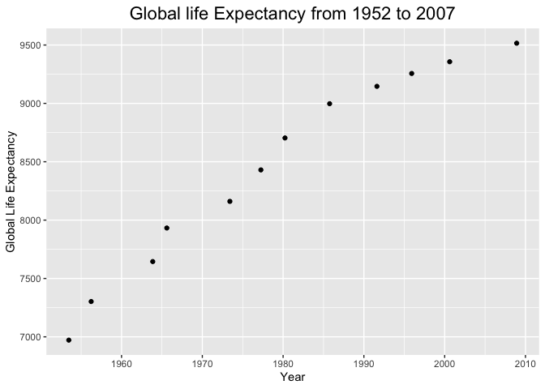
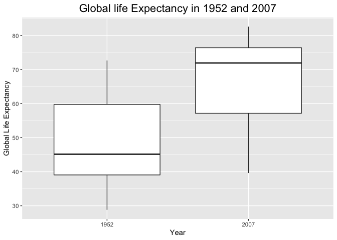
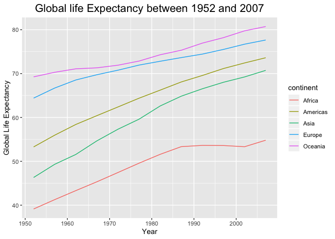
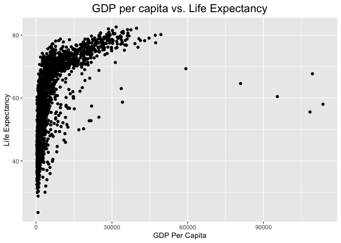
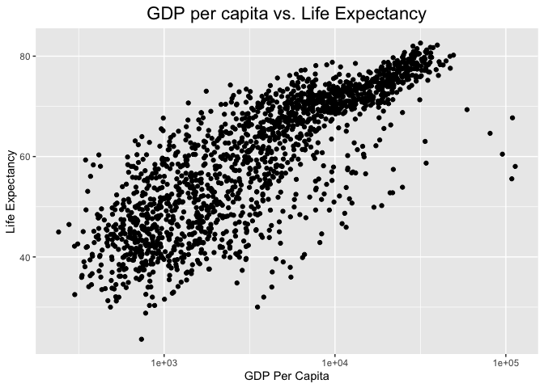
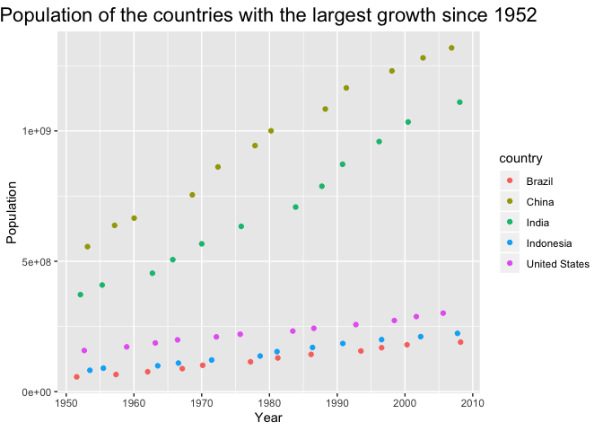
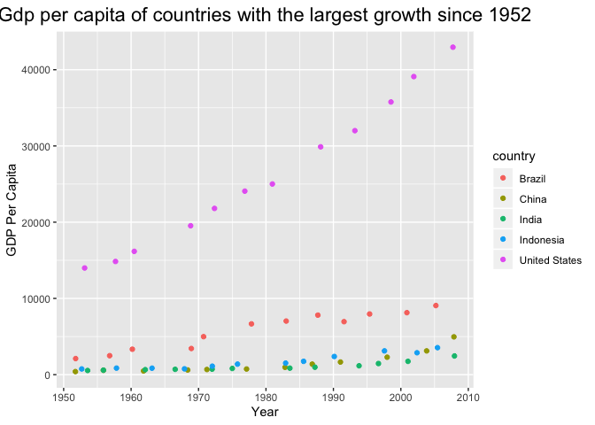

## Instructions
Answer the following questions and complete the exercises in RMarkdown. Please embed all of your code and push your final work to your repository. Your final lab report should be organized, clean, and run free from errors. Remember, you must remove the `#` for any included code chunks to run.  

## Libraries

```r
library(tidyverse)
```

## Resources
The idea for this assignment came from [Rebecca Barter's](http://www.rebeccabarter.com/blog/2017-11-17-ggplot2_tutorial/) ggplot tutorial so if you get stuck this is a good place to have a look.  

## Gapminder
For this assignment, we are going to use the dataset [gapminder](https://cran.r-project.org/web/packages/gapminder/index.html). Gapminder includes information about economics, population, and life expectancy from countries all over the world. You will need to install it before use. This is the same data that we used for the practice midterm. You may want to load that assignment for reference.  

```r
#install.packages("gapminder")
library("gapminder")
```

## Questions
The questions below are open-ended and have many possible solutions. Your approach should, where appropriate, include numerical summaries and visuals. Be creative; assume you are building an analysis that you would ultimately present to an audience of stakeholders. Feel free to try out different `geoms` if they more clearly present your results.  

**1. Use the function(s) of your choice to get an idea of the overall structure of the data frame, including its dimensions, column names, variable classes, etc. As part of this, determine how NAs are treated in the data.**  

```r
gapminder <- gapminder
dim(gapminder)
```

```
## [1] 1704    6
```

```r
names(gapminder)
```

```
## [1] "country"   "continent" "year"      "lifeExp"   "pop"       "gdpPercap"
```

```r
lapply(gapminder, class)
```

```
## $country
## [1] "factor"
## 
## $continent
## [1] "factor"
## 
## $year
## [1] "integer"
## 
## $lifeExp
## [1] "numeric"
## 
## $pop
## [1] "integer"
## 
## $gdpPercap
## [1] "numeric"
```


```r
naniar::miss_var_summary(gapminder)
```

```
## # A tibble: 6 x 3
##   variable  n_miss pct_miss
##   <chr>      <int>    <dbl>
## 1 country        0        0
## 2 continent      0        0
## 3 year           0        0
## 4 lifeExp        0        0
## 5 pop            0        0
## 6 gdpPercap      0        0
```

There are no NAs in the data. 

**2. Among the interesting variables in gapminder is life expectancy. How has global life expectancy changed between 1952 and 2007?**

```r
gapminder %>% 
  filter(year <= 2007 & year >= 1952) %>% 
  group_by(year) %>% 
  summarize(global_lifeExp = sum(lifeExp)) %>% 
  ggplot(aes(x = year, y = global_lifeExp)) +
  geom_jitter() +
  labs(title = "Global life Expectancy from 1952 to 2007",
       x = "Year",
       y = "Global Life Expectancy")+ 
  theme(plot.title = element_text(size = rel(1.5), hjust = 0.5))
```

<!-- -->

Life expectancy increases as time goes on. 

**3. How do the distributions of life expectancy compare for the years 1952 and 2007? _Challenge: Can you put both distributions on a single plot?_**

```r
gapminder %>% 
  filter(year == "2007" | year == "1952") %>% 
  mutate_at(vars(year), as.factor) %>% 
  group_by(year) %>% 
  ggplot(aes(x = year, y = lifeExp)) + 
  geom_boxplot() +
  labs(title = "Global life Expectancy in 1952 and 2007",
       x = "Year",
       y = "Global Life Expectancy")+ 
  theme(plot.title = element_text(size = rel(1.5), hjust = 0.5))
```

<!-- -->


**4. Your answer above doesn't tell the whole story since life expectancy varies by region. Make a summary that shows the min, mean, and max life expectancy by continent for all years represented in the data.**

```r
gapminder2 <- gapminder %>% 
  group_by(continent) %>% 
  summarize(min_lifeExp=min(lifeExp),
            max_lifeExp=max(lifeExp),
            mean_lifeExp=mean(lifeExp)) %>% 
  arrange(mean_lifeExp)
```

**5. How has life expectancy changed between 1952-2007 for each continent? Try using `geom_line()` for this, including all continents on the same  plot.**

```r
gapminder %>% 
  group_by(year, continent) %>% 
  summarize(mean = mean(lifeExp)) %>% 
  ggplot(aes(x = year, y = mean, group = continent, color = continent)) + 
  geom_line()+
  labs(title = "Global life Expectancy between 1952 and 2007",
       x = "Year",
       y = "Global Life Expectancy")+ 
  theme(plot.title = element_text(size = rel(1.5), hjust = 0.5))
```

<!-- -->


**6. We are interested in the relationship between per capita GDP and life expectancy; i.e. does having more money help you live longer?**

```r
gapminder %>% 
  ggplot(aes(x = gdpPercap, y = lifeExp)) + 
  geom_jitter()+
  labs(title = "GDP per capita vs. Life Expectancy",
       x = "GDP Per Capita",
       y = "Life Expectancy")+ 
  theme(plot.title = element_text(size = rel(1.5), hjust = 0.5))
```

<!-- -->

It is hard to tell if there is a relationship or not. 

**7. There is extreme disparity in per capita GDP. Rescale the x axis to make this easier to interpret. How would you characterize the relationship?**

```r
gapminder %>% 
  ggplot(aes(x = gdpPercap, y = lifeExp)) + 
  geom_jitter()+
  scale_x_log10() +
  labs(title = "GDP per capita vs. Life Expectancy",
       x = "GDP Per Capita",
       y = "Life Expectancy")+ 
  theme(plot.title = element_text(size = rel(1.5), hjust = 0.5))
```

<!-- -->

With GDP Per Capita scaled to log values, it is clear that GDP per capita does influence life expectancy. 

**8. Which countries have had the largest population growth since 1952?**

```r
gapminder %>% 
  filter(year >= 1952) %>% 
  group_by(country) %>% 
  summarize(initial_pop= first(pop),
            max_pop=max(pop)) %>% 
  mutate(diff = max_pop - initial_pop) %>% 
  arrange(desc(diff))
```

```
## # A tibble: 142 x 4
##    country       initial_pop    max_pop      diff
##    <fct>               <int>      <int>     <int>
##  1 China           556263527 1318683096 762419569
##  2 India           372000000 1110396331 738396331
##  3 United States   157553000  301139947 143586947
##  4 Indonesia        82052000  223547000 141495000
##  5 Brazil           56602560  190010647 133408087
##  6 Pakistan         41346560  169270617 127924057
##  7 Bangladesh       46886859  150448339 103561480
##  8 Nigeria          33119096  135031164 101912068
##  9 Mexico           30144317  108700891  78556574
## 10 Philippines      22438691   91077287  68638596
## # <U+2026> with 132 more rows
```

China and India had the largest population growth since 1952

**9. Use your results from the question above to plot population growth for the top five countries since 1952.**

```r
gapminder %>% 
  filter(country == "China" | country == "India" | country == "United States" | country == "Indonesia" | country == "Brazil" ) %>% 
  ggplot(aes(x = year, y = pop, color = country)) +
  geom_jitter() +
  labs(title = "Population of the countries with the largest growth since 1952",
       x = "Year",
       y = "Population")+ 
  theme(plot.title = element_text(size = rel(1.5), hjust = 0.5))
```

<!-- -->


**10. How does per capita GDP growth compare between these same five countries?**

```r
gapminder %>% 
  filter(country == "China" | country == "India" | country == "United States" | country == "Indonesia" | country == "Brazil" ) %>% 
  ggplot(aes(x = year, y = gdpPercap, color = country)) +
  geom_jitter() +
  labs(title = "Gdp per capita of countries with the largest growth since 1952",
       x = "Year",
       y = "GDP Per Capita")+ 
  theme(plot.title = element_text(size = rel(1.5), hjust = 0.5))
```

<!-- -->


## Push your final code to GitHub!
Please be sure that you check the `keep md` file in the knit preferences. 
